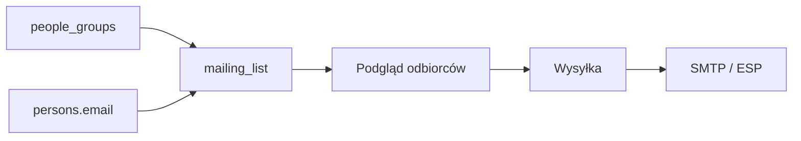

# Listy mailingowe — plan (późniejsza faza)

**Status:** `planned`  
**Created:** 2026-07-09  
**Issue:** [#015](../issues/2026-07-09--015--mailing-lists.md)  
**Depends on:** [people-groups.md](./2026-07-09--people-groups.md), [church-assignment-visibility.md](./2026-07-09--church-assignment-visibility.md)

## Cel

Komunikacja e-mailowa wewnątrz organizacji CHWZ: ogłoszenia, newslettery, wiadomości do grup (Prezydium, Grupa Ewangelizacji, …). **Nie w scope MVP** platformy zborów — dokumentacja na później.

## Założenia

1. **Źródło adresów:** `persons.email` tylko gdy użytkownik wyraził zgodę / adres jest widoczny dla odbiorców wewnętrznych
2. **Segmentacja:** listy statyczne + listy oparte o `people_groups`
3. **Dostawca:** SMTP aplikacji lub zewnętrzny (SendGrid, Brevo, …) — decyzja przy implementacji
4. **RODO:** rejestr zgód, opt-out, podgląd przed wysyłką

## Model danych (szkic)

```
mailing_lists
- id, name, slug, description
- source_type             -- static | group | query
- source_group_id (nullable)
- created_at

mailing_list_subscribers
- id, list_id, person_id (nullable), email
- subscribed_at, unsubscribed_at
- consent_source

mailing_campaigns (opcjonalnie później)
- id, list_id, subject, body_html, sent_at, sent_by
```

## Przepływ (docelowy)



## Fazy

| Faza | Zakres |
|------|--------|
| 0 | Ten dokument + issue #015 |
| 1 | Listy statyczne, ręczne dodawanie e-maili |
| 2 | Listy z grup ludzi (#014) |
| 3 | Kampanie, szablony, statystyki otwarć (opcjonalnie) |

## Ryzyka

- Wysyłka bez zgody — wymaga jawnej polityki i audytu
- Duplikaty adresów przy łączeniu grup — deduplikacja po `email`
- Ukryte e-maile na karcie zboru ≠ brak zgody na mailing wewnętrzny — osobne pole `marketing_consent`?

## Powiązane

- [#014](../issues/2026-07-09--014--people-groups.md) — grupy jako segmenty
- [#012](../issues/2026-07-09--012--unify-services-remove-contact-persons.md) — widoczność pól kontaktu
