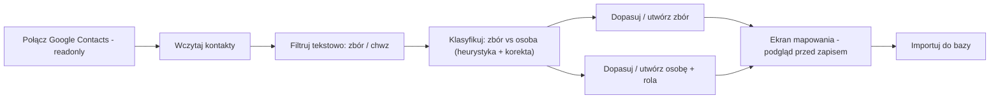
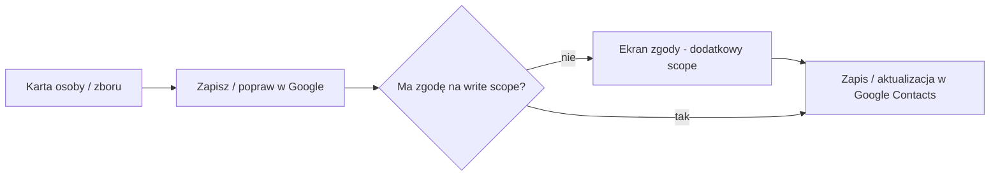

# Synchronizacja z Google Contacts — plan

**Status:** `in-progress` (Faza 1 zaimplementowana)
**Created:** 2026-07-10
**Issue:** [#038](../issues/2026-07-10--038--google-contacts-sync.md)
**Depends on:** [church-assignment-visibility.md](./2026-07-09--church-assignment-visibility.md)

## Cel

Dwukierunkowa (ale nie automatyczna) integracja z Google Contacts:

- **Import** (Google → aplikacja) — admin/owner wczytuje ze swojej książki kontaktów Google pozycje pasujące do filtra „zbór”/„chwz” i importuje je do bazy jako zbory (`church`) i/lub osoby (`person` + `service_assignment`).
- **Export** (aplikacja → Google) — dowolny zalogowany użytkownik może ręcznie zapisać lub poprawić pojedynczy kontakt (osobę albo zbór) w swojej własnej książce Google Contacts.

## Ustalenia (2026-07-10)

Poniższe decyzje zapadły w rozmowie planistycznej i są wiążące dla dalszego projektowania:

1. **Import** (Google → baza): tylko **admin/owner** zboru/tenanta.
2. **Export** (baza → Google): **każdy zalogowany użytkownik**, wyłącznie dla własnego konta Google.
3. **Filtr „zbór”/„chwz”:** wyszukiwanie tekstowe w polach kontaktu Google (nazwa, organizacja, notatki) — bez rozróżniania wielkości liter.
4. **Rozróżnienie zbór vs osoba:** heurystyka (kontakt bez imienia/nazwiska, tylko pole „Organizacja” → zbór; kontakt z imieniem i nazwiskiem → osoba) **+ ręczna korekta** na ekranie mapowania.
5. **Dopasowanie zboru** do istniejącego rekordu: auto-dopasowanie po nazwie (fuzzy match) + potwierdzenie admina; brak trafienia → utworzenie nowego zboru.
6. **Dopasowanie osoby** do istniejącego rekordu: auto-match po e-mail/telefonie + potwierdzenie; przy dodaniu do zboru admin wybiera `service_type`/rolę (tworzy `service_assignment`); można też tylko poprawić dane osoby globalnie, bez przypisania do zboru.
7. **Import „Zbór”-kontaktu** aktualizuje/tworzy **cały rekord zboru** (nazwa, adres, telefon, e-mail) — nie tylko osobę kontaktową.
8. **Export** obejmuje **oba typy** — osoby i zbory (ten sam mechanizm).
9. Export/zapis do Google to zawsze **ręczna akcja per kontakt** — brak automatycznej, ciągłej, dwukierunkowej synchronizacji.
10. Zapis do Google wymaga **osobnego, szerszego scope OAuth** (write) niż import (readonly) — żądany dopiero przy pierwszym użyciu eksportu (incremental auth), z jawną, dodatkową zgodą użytkownika.

## Kontekst techniczny (już w repo)

- Logowanie Google (`backend/app/core/oauth.py` → `GoogleOAuthProvider`) używa scope `email profile` i **nie** nadaje się do odczytu/zapisu kontaktów — potrzebne osobne połączenie z innym scope (Google People API: `contacts.readonly` do importu, `contacts` do zapisu).
- Model `PersonDB` (`backend/app/modules/churches/db_models.py`) nie ma bezpośredniego FK do zboru — powiązanie idzie przez `ServiceAssignmentDB.scope_id/scope_type`. Import osoby „do zboru” oznacza więc utworzenie `service_assignment`, nie zmianę pola na `persons`.
- Nie istnieje obecnie żaden endpoint/tabela dot. Google Contacts — to całkowicie nowy moduł.

## Model danych (szkic)

```
google_contacts_connections
- id, user_id (FK users, unique per scope)
- scope                    -- readonly | readonly_write
- access_token (encrypted), refresh_token (encrypted)
- expires_at
- connected_at, revoked_at (nullable)

google_contacts_import_log            -- audyt importu
- id, user_id, google_resource_name
- entity_type              -- church | person
- matched_entity_id (nullable)
- action                   -- created | updated | skipped
- imported_at
```

Do decyzji przy implementacji: osobna tabela `google_contacts_connections` vs rozszerzenie istniejącej `oauth_connections` o `scope`/`purpose`.

## Przepływ — Import (admin/owner)



## Przepływ — Export (dowolny zalogowany)



## Role i uprawnienia

| Akcja | Kto |
|-------|-----|
| Import Google → baza (zbory i osoby) | admin, owner (z uprawnieniem do zarządzania danym zborem/tenantem) |
| Export baza → Google (pojedynczy kontakt) | każdy zalogowany, wyłącznie do własnego konta Google |
| Połączenie konta Google Contacts (readonly) | admin/owner przed użyciem importu |
| Zgoda na write scope | dowolny użytkownik przed pierwszym eksportem |

## Fazy

| Faza | Zakres | Status |
|------|--------|--------|
| 0 | Ten dokument + issue #038 | ✅ |
| 1 | Połączenie Google Contacts (readonly) + wczytanie i filtr tekstowy | ✅ backend (`app/modules/google_contacts/`, migracja 066) |
| 2 | Klasyfikacja zbór/osoba + ekran mapowania (dopasowanie/tworzenie, podgląd) | ⏳ (heurystyka klasyfikacji już gotowa w `classification.py`, brakuje ekranu mapowania + frontendu) |
| 3 | Import do bazy: `church` oraz `person` + `service_assignment` | ⏳ |
| 4 | Export — zapis/aktualizacja pojedynczego kontaktu w Google (write scope, incremental auth) | ⏳ |

### Faza 1 — szczegóły implementacji

- Nowy moduł backendu `app/modules/google_contacts/` (db_models, oauth_provider, service, repositories, router, classification, crypto_utils).
- Osobny redirect URI (`GOOGLE_CONTACTS_REDIRECT_URI`) na tym samym kliencie OAuth co logowanie (`GOOGLE_OAUTH_CLIENT_ID/SECRET`), incremental auth (`access_type=offline`, `prompt=consent`, `include_granted_scopes=true`).
- Tokeny szyfrowane (Fernet, jak w module 2FA) w tabeli `google_contacts_connections` (migracja `066_google_contacts_connections.py`).
- Endpointy (admin/owner only): `POST /api/google-contacts/auth-url`, `POST /api/google-contacts/callback`, `GET/DELETE /api/google-contacts/connection`, `GET /api/google-contacts/contacts` (filtr „zbór”/„chwz” zastosowany po stronie backendu, People API nie wspiera takiego wyszukiwania natywnie).
- Testy: `tests/unit/google_contacts/`, `tests/integration/google_contacts/`.
- Nie zrobione w tej fazie: frontend (przycisk „Połącz Google Contacts”, lista wyników), tabela `google_contacts_import_log`, ekran mapowania.

## Ryzyka

- **RODO:** import prywatnej książki adresowej admina do współdzielonej bazy — admin musi być jawnie poinformowany, że zaimportowane dane trafiają do systemu i mogą być widoczne innym (zależnie od `visibility`/`card_visibility`).
- **Duplikaty:** nietrafione auto-dopasowanie zboru lub osoby może stworzyć duplikat — dlatego ekran mapowania zawsze wymaga potwierdzenia przed zapisem (nie ma trybu w pełni automatycznego).
- **Google OAuth verification:** scope zapisu (`https://www.googleapis.com/auth/contacts`) jest wrażliwy i wymaga weryfikacji aplikacji przez Google (CASA/OAuth verification) przed użyciem produkcyjnym — do uwzględnienia w harmonogramie.
- **Heurystyka zbór/osoba** może się mylić przy nietypowych wpisach (np. osoba zapisana z nazwą organizacji w polu firmy) — stąd wymagana ręczna korekta na ekranie mapowania.

## Powiązane

- [#012](../issues/2026-07-09--012--unify-services-remove-contact-persons.md) — widoczność pól kontaktowych (email/tel.) na karcie zboru, dotyczy eksportu
- [#014](../issues/2026-07-09--014--people-groups.md) — zaimportowane osoby mogą być później dodane do grup
- [#018](../issues/2026-07-10--018--congregation-address-data-quality.md), [#026](../issues/2026-07-10--026--country-iso-province-normalization.md) — jakość danych adresowych przy tworzeniu nowego zboru z importu
