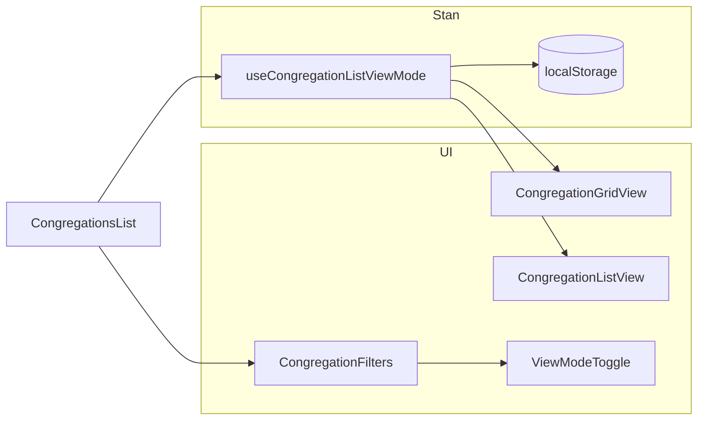

# Przełącznik widoku list/grid — lista zborów

**Status:** `planned`
**Created:** 2026-07-11
**Related:** [UX review — cards view jako alternatywa](../reviews/2025-01-20--ux-review.md)

## Cel

Dodać przełącznik wyświetlania listy zborów w dwóch trybach: **grid** (obecne karty) i **list** (kompaktowe wiersze). Wybór użytkownika zapisywany w `localStorage`; domyślnie **grid**.

## Kontekst

Lista zborów jest renderowana w [`CongregationsList.vue`](../../src/modules/congregations/components/CongregationsList.vue) (używana na [`LandingPage.vue`](../../src/pages/LandingPage.vue)). Obecnie wszystkie zbiory wyświetlane są jako **karty w siatce 2-kolumnowej** (`grid gap-4 sm:grid-cols-1 lg:grid-cols-2`).

W projekcie **nie ma jeszcze** wzorca przełączania widoków, ale jest gotowy [`ButtonGroup`](../../src/components/ui/button-group/ButtonGroup.vue) (niewykorzystany) oraz `@vueuse/core` z `useLocalStorage`.



## Definicja widoków

| Widok | Opis | Domyślny |
|-------|------|----------|
| **grid** | Obecny układ kart (2 kolumny na `lg+`, 1 na mobile) | tak |
| **list** | Kompaktowe wiersze: ikona + nazwa/status + adres/miasto + godziny nabożeństw w jednej linii (mobile: stack), menu akcji po prawej | nie |

Oba widoki zachowują istniejące zachowanie: kliknięcie otwiera szczegóły (poza placówkami), dropdown edycji/usuwania, style statusów (`draft`, `published_unverified`), badge placówki.

## Implementacja

### 1. Typ i composable stanu widoku

**Nowe pliki:**

- [`src/modules/congregations/types/congregationListView.types.ts`](../../src/modules/congregations/types/congregationListView.types.ts) — union type:

  ```ts
  export type CongregationListViewMode = 'list' | 'grid'
  ```

- [`src/modules/congregations/composables/useCongregationListViewMode.ts`](../../src/modules/congregations/composables/useCongregationListViewMode.ts) — `useLocalStorage<CongregationListViewMode>('congregations-list-view-mode', 'grid')` z walidacją wartości (fallback do `'grid'` przy nieznanym kluczu w storage).

Wzorzec persystencji analogiczny do [`useDarkMode.ts`](../../src/shared/composables/useDarkMode.ts), ale prostszy dzięki `useLocalStorage`.

### 2. Ekstrakcja komponentów wyświetlania

Wyodrębnić markup z pętli `v-for` (linie 289–447) do dwóch komponentów, żeby uniknąć duplikacji logiki biznesowej:

**[`CongregationListCard.vue`](../../src/modules/congregations/components/CongregationListCard.vue)** — przeniesienie obecnej karty 1:1 (grid view).

**[`CongregationListRow.vue`](../../src/modules/congregations/components/CongregationListRow.vue)** — kompaktowy wiersz:

- `flex items-center gap-3` na desktop, `flex-col sm:flex-row` na mobile
- Lewa: ikona `Church` (mniejsza, `size-8`)
- Środek: nazwa + badge'e, pod spodem adres i godziny (skrócone `line-clamp-1`), kontakty opcjonalnie ukryte lub tylko pierwszy kontakt
- Prawa: dropdown akcji (ten sam co w karcie)
- Te same klasy statusów i `@click` / `@click.stop` co w karcie

Wspólne props dla obu komponentów:

```ts
interface Props {
  congregation: ICongregationDetailed
  canManage: boolean
  canDelete: boolean
}
```

Emits: `open`, `edit`, `unpublish`, `delete` — logika pozostaje w rodzicu [`CongregationsList.vue`](../../src/modules/congregations/components/CongregationsList.vue).

Funkcje pomocnicze `formatAddress`, `formatServiceTimes` przenieść do nowego utila [`congregationDisplay.ts`](../../src/modules/congregations/utils/congregationDisplay.ts), używanego w obu komponentach.

### 3. Przełącznik widoku w filtrach

**[`CongregationViewModeToggle.vue`](../../src/modules/congregations/components/CongregationViewModeToggle.vue)** — nowy komponent:

- `ButtonGroup` + dwa `Button` (`size="sm"`, `variant="outline"` / `"default"` dla aktywnego)
- Ikony: `LayoutGrid`, `List` z `lucide-vue-next`
- `v-model` przez `defineModel<CongregationListViewMode>('viewMode')`
- Atrybuty a11y: `role="group"`, `aria-label`, `aria-pressed` na aktywnym przycisku

Integracja w [`CongregationFilters.vue`](../../src/modules/congregations/components/CongregationFilters.vue):

- Nowy prop `defineModel<CongregationListViewMode>('viewMode')`
- Umieszczenie toggle w wierszu z licznikiem wyników (linia 135–157): `flex justify-between` — po lewej checkbox placówek, po prawej toggle + reset

### 4. Aktualizacja CongregationsList.vue

- Import `useCongregationListViewMode`
- Przekazanie `v-model:view-mode` do `CongregationFilters`
- Zamiana bloku kart na warunkowy render:

  ```vue
  <div v-if="viewMode === 'grid'" class="grid gap-4 sm:grid-cols-1 lg:grid-cols-2">
    <CongregationListCard v-for="..." ... />
  </div>
  <div v-else class="divide-y rounded-lg border">
    <CongregationListRow v-for="..." ... />
  </div>
  ```

- Skeleton loading: grid — obecne `h-32`; list — `h-16` w `divide-y` kontenerze

### 5. i18n

Dodać klucze w [`pl.ts`](../../src/modules/congregations/i18n/locales/pl.ts) i [`en.ts`](../../src/modules/congregations/i18n/locales/en.ts):

```ts
list: {
  view: {
    grid: 'Siatka' / 'Grid',
    list: 'Lista' / 'List',
    toggleLabel: 'Tryb wyświetlania' / 'Display mode',
  },
}
```

Zaktualizować [`congregations.i18n.spec.ts`](../../src/modules/congregations/i18n/congregations.i18n.spec.ts) o nowe klucze.

### 6. Testy (minimalne)

- [`useCongregationListViewMode.spec.ts`](../../src/modules/congregations/composables/useCongregationListViewMode.spec.ts) — domyślnie `'grid'`, zapis/odczyt z localStorage, fallback przy invalid value.

Bez testów E2E/komponentowych na tym etapie.

## Pliki do zmiany / utworzenia

| Akcja | Plik |
|-------|------|
| Nowy | `types/congregationListView.types.ts` |
| Nowy | `composables/useCongregationListViewMode.ts` |
| Nowy | `composables/useCongregationListViewMode.spec.ts` |
| Nowy | `utils/congregationDisplay.ts` |
| Nowy | `components/CongregationViewModeToggle.vue` |
| Nowy | `components/CongregationListCard.vue` |
| Nowy | `components/CongregationListRow.vue` |
| Edycja | `components/CongregationsList.vue` |
| Edycja | `components/CongregationFilters.vue` |
| Edycja | `i18n/locales/pl.ts`, `en.ts`, `congregations.i18n.spec.ts` |

## Weryfikacja ręczna

1. Otwórz `/` (LandingPage) z kilkoma zborami
2. Przełącz grid ↔ list — layout się zmienia, filtry/wyszukiwanie działają w obu trybach
3. Odśwież stronę — wybrany widok zachowany w localStorage
4. Mobile (`sm` i mniej) — list view czytelny, toggle dostępny
5. Akcje edycji/usuwania/cofnięcia publikacji działają w obu widokach
6. `pnpm test:run` — nowy test composable przechodzi

## Poza zakresem

- Synchronizacja widoku z URL (filtry mają URL, widok — nie)
- Zmiana układu admin [`AdminCongregationsPage.vue`](../../src/modules/admin/pages/AdminCongregationsPage.vue) (osobna tabela)
- Dodawanie shadcn `toggle-group` (wystarczy istniejący `ButtonGroup`)

## Checklist implementacji

- [ ] Typ `CongregationListViewMode` i composable `useCongregationListViewMode` z localStorage (default: grid)
- [ ] Wyodrębnienie `CongregationListCard` i `CongregationListRow` + util `congregationDisplay.ts`
- [ ] `CongregationViewModeToggle` podpięty w `CongregationFilters` (`v-model viewMode`)
- [ ] Aktualizacja `CongregationsList.vue` — warunkowy render grid/list + skeleton loading
- [ ] Klucze i18n (pl/en) + test composable + aktualizacja `congregations.i18n.spec.ts`
